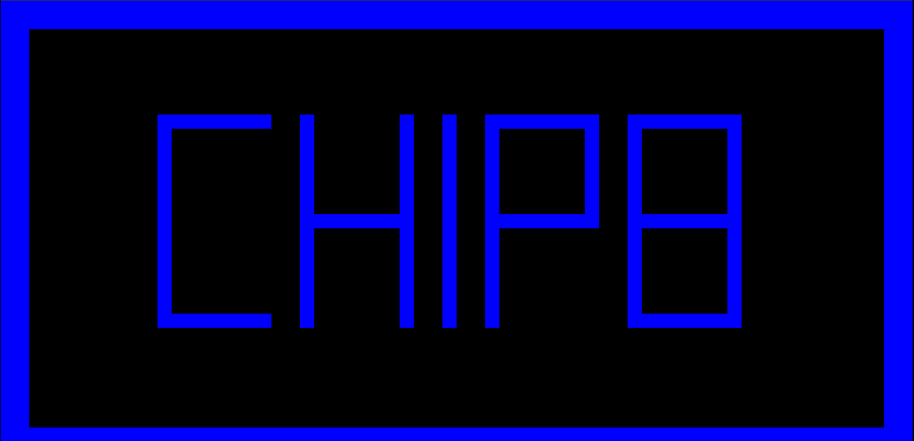

# CHIP-8 Emulator
## Overview
A basic emulator for the CHIP-8 virtual machine written in C++ with Simple DirectMedia Layer (SDL) for graphics rendering. 

This is my first C++ project and I used this as an opportunity to learn modern C++ practices. This includes the use of high level C++ abstractions as well utilising automated memory management. However, my limited experience with C++ will definitely show with less than ideal solutions at times. 

Please feel free to pull request any improvements you see.

### Features
- Replication of the CHIP-8 instruction set architecture.
- Cross-platform rendering of graphics using SDL.

### Image of Program


## Quick Start
### Dependencies
This project relies on the SDL graphics library. Run the following commands (or your distro's equivalent) to download these dependencies:
1. ``sudo apt-get install libsdl2-dev``
2. ``sudo apt-get install libsdl2-image-dev``
3. ``sudo apt-get install libsdl2-ttf-dev``
4. ``sudo apt-get install libsdl2-mixer-dev``

### Building
This project relies on the CMake build system generator. To build, simply run:
```sh
$ cmake --build build
```

The program can then be started by running:
```sh
$ ./build/chip8
```

## Project Structure
- ``main.cpp`` - Main entry point to the program. Contains minimal logic other than the main loop.

- ``src/Emulator`` - Core emulation logic. Composed of all other classes and is responsible for delegating work between classes. Also contains the implementation of the CHIP-8 instruction set and fetch-execute cycle. 

- ``src/GUI`` - C++ class wrapper for functions in the SDL library. Encapsulates the graphics rendering logic and provides a simplified interface specifically for CHIP-8 emulation.

- ``src/Memory`` - Simple class that provides an abstraction for the CHIP-8 memory.

- ``src/Stack`` - Simple class that provides an abstraction for the CHIP-8 stack. Note: is implemented separately from the emulated memory.

- ``src/DecodedInstruction`` - Simple data class that converts an 16 bit opcode into its constituent parts.

- ``src/Parser`` - Simple helper function to convert a raw binary ROM into a byte vector.

- ``src/Keyboard`` - Mapping between QWERTY keyboard and the CHIP-8 keyboard.

- ``src/Display`` - Simple class to encapsulate the logic for pixels on the CHIP-8 display. Note: does **NOT** contain any graphics rendering logic.

- ``src/Fonts`` - Sprite data for basic fonts which is to be stored in the CHIP-8 memory.
